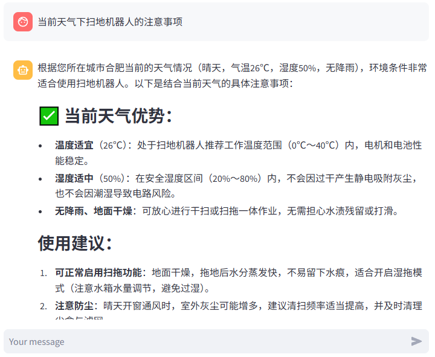
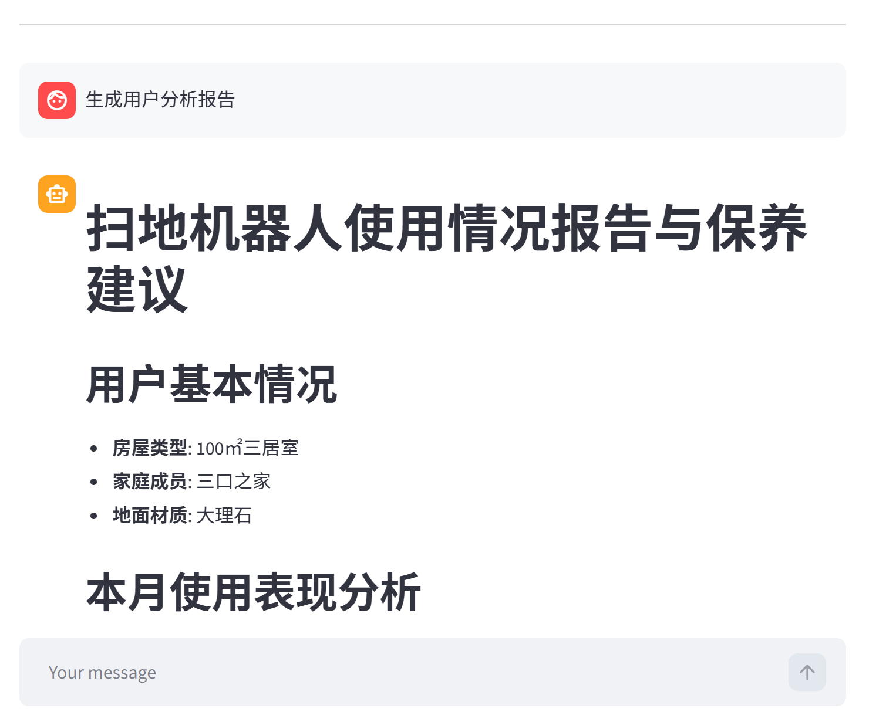

# 🤖 LangChain Agent 智能客服


## 项目概述

- 本项目聚焦于智能客服场景下的 Agent 应用实践，通过引入知识库检索、工具调用和动态提示词切换，实现对用户咨询、故障问答和使用报告生成等任务的支持。  
- 项目当前以扫地机器人为示例场景，后续也可扩展到其他垂直客服场景。
---

## 核心特性

#### 1. ReAct Agent 多工具调用
- 集成外部信息查询、用户信息获取等工具能力，支持 Agent 根据任务自动选择合适工具完成辅助推理。

#### 2. RAG 检索增强问答
- 基于向量数据库构建知识库检索能力，支持对扫地机器人相关文档进行召回与问答生成，提升回复准确性。

#### 3. 个性化报告生成
- 通过动态提示词切换，在普通问答模式与报告生成模式之间灵活切换，为用户生成定制化使用分析内容。

#### 4. Streamlit 流式对话界面
- 提供可交互的聊天界面，支持流式输出，便于展示完整的 Agent 问答过程与使用体验。

#### 5. 模块化工程结构
- 项目按 Agent、RAG、模型层、配置层、工具层等模块进行拆分，便于理解整体架构并支持后续扩展。

---
## 项目结构

```bash
.
├── agent/                       # Agent 核心逻辑
│   ├── react_agent.py           # ReAct智能体主逻辑
│   ├── tools/                   # 工具函数集合
│   └── middleware.py            # 中间件管理
├── assets/                      # README 展示图片等静态资源
├── config/                      # YAML 配置文件
│   ├── agent.yml                # 智能体配置
│   ├── chroma.yml               # 向量库配置
│   ├── prompts.yml              # 提示词配置
│   └── rag.yml                  # RAG配置
├── data/                        # 知识库文档与外部数据
├── model/                       # 模型工厂与模型初始化
│   └── factory.py               # 模型工厂
├── prompts/                     # 提示词模板
├── rag/                         # 检索增强相关模块
│   ├── rag_service.py           # 检索服务
│   └── vector_store.py          # 向量存储
├── utils/                       # 通用工具函数
│   ├── config_handler.py        # 配置加载
│   ├── file_handler.py          # 文件处理
│   ├── logger_handler.py        # 日志管理
│   ├── path_tool.py             # 路径工具
│   └── prompt_loader.py         # 提示词加载
├── app.py                       # Streamlit 应用入口
├── requirements.txt
└── README.md
```

## 工作流程


1. 用户在 Streamlit 页面输入问题

2. Agent 判断当前任务类型 -> 普通问答 / 报告生成

3. 普通问答场景下，调用 RAG 模块检索知识库内容

4. 特定任务场景下，调用外部工具或结构化数据进行辅助生成

5. 最终结果通过流式方式返回到前端界面

---
## 效果预览

### 1. 聊天界面展示
- 展示用户在前端输入问题后，系统返回问答结果的整体效果。


### 2. Agent 工具调用过程
- 展示 Agent 在任务处理中调用外部工具或执行中间推理的过程。
  


### 3. 报告生成示例
- 展示系统根据用户数据生成个性化分析报告的结果页面。




---


## 快速开始

### 环境要求
- Python 3.10 及以上
- 可用的大模型 API Key（如阿里云百炼）

### 运行前准备
- 安装项目依赖
- 配置模型 API Key
- 准备知识库文档与相关配置文件

---

## 安装步骤

- 克隆项目
```bash

git clone https://github.com/lhh737/LangChain-ReAct-Agent.git
```
- 安装依赖
```bash
pip install -r requirements.txt -i https://pypi.tuna.tsinghua.edu.cn/simple
```
- 配置环境变量

- 在config目录下创建调整相应的 yml 配置文件
```bash
export DASHSCOPE_API_KEY="your-api-key"
```
- 启动应用
```bash
streamlit run app.py
```
---


## 支持的任务类型

- **知识库问答**：针对扫地机器人等相关文档进行检索与问答生成
- **工具辅助问答**：在需要外部信息时调用工具增强回复效果
- **报告生成**：根据输入数据与任务要求生成个性化分析报告
- **多场景提示词切换**：根据任务类型自动选择合适的提示词模板

---

## 配置说明

- 项目主要通过 YAML 文件进行配置管理，首次运行时，建议优先检查以下文件：

> `config/agent.yml` ：Agent 行为与任务流程相关配置

> `config/chroma.yml` ：向量数据库与检索存储配置

> `config/prompts.yml` ：不同任务场景下的提示词配置

> `config/rag.yml` ：RAG 检索参数配置


- 若只想完成最小化本地运行，建议先确保：
1. 已正确配置模型 API Key

2. `config/` 下必要的 YAML 文件已存在

3. `data/` 目录中已放入知识库文档
---
## 最小成功演示

- 应用启动后，可先尝试以下问题验证项目是否正常运行：

#### 普通问答
- 扫地机器人有哪些主要功能？
- 如果机器人无法正常回充，该如何处理？

#### 报告生成
- 请根据用户数据生成一份个性化使用报告。

如果以上问题能够正常返回内容，说明项目的基础问答与任务切换流程已经运行成功。


---

